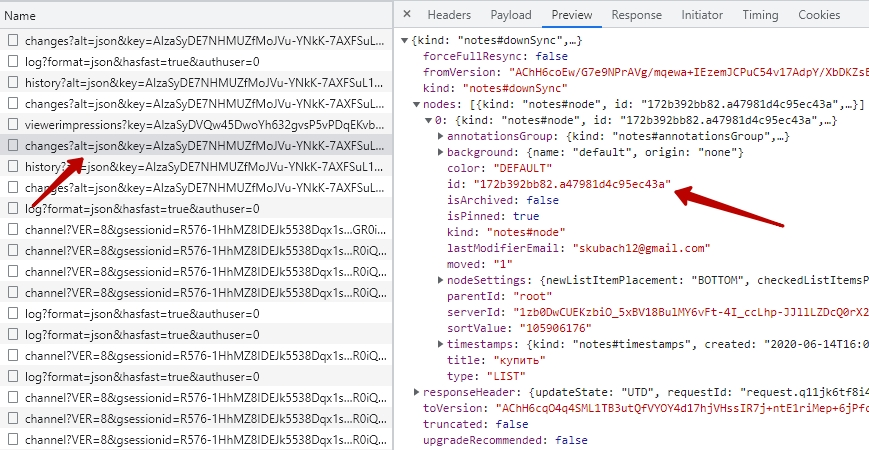
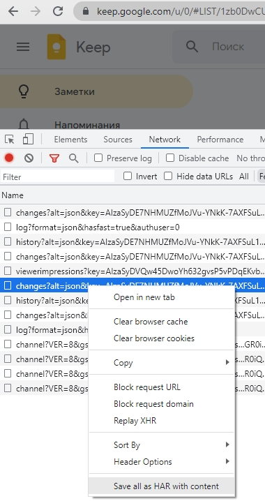

# Skill "Checklist" for Alice voice assistant from Yandex.Dialogs based on Google Keep Notes [{ru}](/README_RU.md)
[](#)
[](#)
[](#)
[](#)
[](https://github.com/boltdb/bolt)
[](#)

The repository contains an application that implements a skill for Alice's voice assistant.
The idea is based on the service from Google Keep Notes, which allows you to manage notes as
in the web application and in the mobile application.
In particular, from the point of view of convenience, a widget for the Android desktop is used.

Notes have a display format in the form of a checklist. Note management allows you to
fast typing of words based on existing notes.

The main functionality is:
1. [x] Adding new checklist items to Google Keep
2. [x] Deleting items by marking them with a check mark - it is necessary that the old items are not physically deleted, 
but remained for the convenience of speed dialing

Description of the implementation on [habr](https://habr.com/ru/post/667750/).

## App settings
1. In file ```configs/googlekeep/config.yml``` specify the id of the Google Keep Notes list, 
where the checklist items will be managed (can be found in the web application request ```/notes/v1/changes```): 
<details>
  <summary>Example of getting noteRootId</summary>

url: https://keep.google.com

</details>

```yaml
noteRootId: "1650040828816.1396523598"
```
2. Save to file ```configs/googlekeep/keep.google.com.har``` har content of the web application.
<details>
  <summary>Example of getting a har file</summary>


</details>

The necessary cookies and headers for sending requests to Google Keep will be extracted from this file.

## Yandex.Dialog settings
### Intent list
<details>
  <summary>Grammar</summary>

```yaml
root:
  (.*) $List (.*)

slots:
  list:
    source: $List
$List:
  %lemma
  список | лист | покупка
```
</details>

### Intent add_delete_products
<details>
  <summary>Grammar</summary>

```yaml
root:
  %lemma
  $Add $Product1 (и $Product2)*  (и $Product3)*  (и $Product4)*  (и $Product5)*  (и $Product6)*  (и $Product7)*  (и $Product8)*  (и $Product9)*  (и $Product10)*
  $Delete $Product11 (и $Product12)* (и $Product13)* (и $Product14)* (и $Product15)* (и $Product16)* (и $Product17)* (и $Product18)* (и $Product19)* (и $Product20)*
  $Add $Product1 (и $Product2)*  (и $Product3)*  (и $Product4)*  (и $Product5)*  (и $Product6)*  (и $Product7)*  (и $Product8)*  (и $Product9)*  (и $Product10)*  $Delete $Product11 (и $Product12)* (и $Product13)* (и $Product14)* (и $Product15)* (и $Product16)* (и $Product17)* (и $Product18)* (и $Product19)* (и $Product20)*
  $Delete $Product11 (и $Product12)* (и $Product13)* (и $Product14)* (и $Product15)* (и $Product16)* (и $Product17)* (и $Product18)* (и $Product19)* (и $Product20)* $Add $Product1 (и $Product2)*  (и $Product3)*  (и $Product4)*  (и $Product5)*  (и $Product6)*  (и $Product7)*  (и $Product8)*  (и $Product9)*  (и $Product10)*
  $Product1 (и $Product2)*  (и $Product3)*  (и $Product4)*  (и $Product5)*  (и $Product6)*  (и $Product7)*  (и $Product8)*  (и $Product9)*  (и $Product10)* $Add
  $Product11 (и $Product12)* (и $Product13)* (и $Product14)* (и $Product15)* (и $Product16)* (и $Product17)* (и $Product18)* (и $Product19)* (и $Product20)* $Delete
  $Product1 (и $Product2)*  (и $Product3)*  (и $Product4)*  (и $Product5)*  (и $Product6)*  (и $Product7)*  (и $Product8)*  (и $Product9)*  (и $Product10)* $Add $Product11 (и $Product12)* (и $Product13)* (и $Product14)* (и $Product15)* (и $Product16)* (и $Product17)* (и $Product18)* (и $Product19)* (и $Product20)* $Delete
  $Product11 (и $Product12)* (и $Product13)* (и $Product14)* (и $Product15)* (и $Product16)* (и $Product17)* (и $Product18)* (и $Product19)* (и $Product20)* $Delete $Product1 (и $Product2)*  (и $Product3)*  (и $Product4)*  (и $Product5)*  (и $Product6)*  (и $Product7)*  (и $Product8)*  (и $Product9)*  (и $Product10)* $Add
  $Product1 (и $Product2)*  (и $Product3)*  (и $Product4)*  (и $Product5)*  (и $Product6)*  (и $Product7)*  (и $Product8)*  (и $Product9)*  (и $Product10)* $Add $Delete $Product11 (и $Product12)* (и $Product13)* (и $Product14)* (и $Product15)* (и $Product16)* (и $Product17)* (и $Product18)* (и $Product19)* (и $Product20)*
  $Product11 (и $Product12)* (и $Product13)* (и $Product14)* (и $Product15)* (и $Product16)* (и $Product17)* (и $Product18)* (и $Product19)* (и $Product20)* $Delete $Add $Product1 (и $Product2)*  (и $Product3)*  (и $Product4)*  (и $Product5)*  (и $Product6)*  (и $Product7)*  (и $Product8)*  (и $Product9)*  (и $Product10)*
slots:
  add1:
    source: $Product1
  add2:
    source: $Product2
  add3:
    source: $Product3
  add4:
    source: $Product4
  add5:
    source: $Product5
  add6:
    source: $Product6
  add7:
    source: $Product7
  add8:
    source: $Product8
  add9:
    source: $Product9
  add10:
    source: $Product10
  del1:
    source: $Product11
  del2:
    source: $Product12
  del3:
    source: $Product13
  del4:
    source: $Product14
  del5:
    source: $Product15
  del6:
    source: $Product16
  del7:
    source: $Product17
  del8:
    source: $Product18
  del9:
    source: $Product19
  del10:
    source: $Product20
$Add:
  %lemma
  добавить | пополнить | создать
$Delete:
  %lemma
  удалить | убрать | уничтожить | уменьшить | удали
$And:
  и | также | а также | еще | кроме того
$Product1:
  .+
$Product2:
  .+
$Product3:
  .+
$Product4:
  .+
$Product5:
  .+
$Product6:
  .+
$Product7:
  .+
$Product8:
  .+
$Product9:
  .+
$Product10:
  .+
$Product11:
  .+
$Product12:
  .+
$Product13:
  .+
$Product14:
  .+
$Product15:
  .+
$Product16:
  .+
$Product17:
  .+
$Product18:
  .+
$Product19:
  .+
$Product20:
  .+
```
</details>

### Activation phrases
> запусти навык чек лист
> 
> добавь овощи и фрукты
> 
> удали макароны
> 
> какой получился список?

> попроси чек лист добавить печенье

> попроси чек лист огласить список

## Requirements
- go 1.18
- docker & docker-compose

## Run Project

Use ```make run``` to build and run docker containers with application itself
