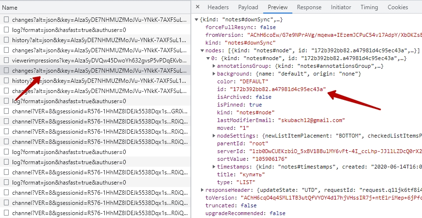

# Навык "Чек-лист" для голосового помощника Алиса от Яндекс.Диалогов на основе Google Keep Notes [{en}](/README.md)
[](#)
[](#)
[](#)
[](#)
[](https://github.com/boltdb/bolt)
[](#)

Репозиторий содержит приложение, реализующее навык для голосового помощника Алиса. 
В основе идеи стоит сервис от Google Keep Notes, который позволяет управлять заметками как 
в веб приложении, так и в мобильном приложении. 
В частности, с точки зрения удобства используется виджет для рабочего стола под Android.

Заметки имеют формат отображения в виде чек-листа. Управление заметками позволяет осуществлять 
быстрый набор слов на основе уже существующих заметок.

Основной функционал подразумевает:
1. [x] Добавление новых пунктов чек-листа в Google Keep
2. [x] Удаление пунктов путем пометки их галочкой - необходимо, чтобы старые пункты физически не удалялись, 
а оставались для удобства работы быстрого набора

Описание реализации на [хабре](https://habr.com/ru/post/667750/).

## Настройки приложения
1. В файле ```configs/googlekeep/config.yml``` укажите id списка Google Keep Notes, 
где будет осуществляться управление пунктами чек-листа (можно найти в запросе web приложения ```/notes/v1/changes```): 
<details>
  <summary>Пример получения noteRootId</summary>

url: https://keep.google.com

</details>

```yaml
noteRootId: "1650040828816.1396523598"
```
2. Сохраните в файл ```configs/googlekeep/keep.google.com.har``` содержимое har контента web приложения.
<details>
  <summary>Пример получения har файла</summary>


</details>

Из этого файла будут извлечены необходимые cookie и заголовки для отправки запросов в Google Keep.

## Настройки Яндекс.Диалогов
### Интент list
<details>
  <summary>Грамматика</summary>

```yaml
root:
  (.*) $List (.*)

slots:
  list:
    source: $List
$List:
  %lemma
  список | лист | покупка
```
</details>

### Интент add_delete_products
<details>
  <summary>Грамматика</summary>

```yaml
root:
  %lemma
  $Add $Product1 (и $Product2)*  (и $Product3)*  (и $Product4)*  (и $Product5)*  (и $Product6)*  (и $Product7)*  (и $Product8)*  (и $Product9)*  (и $Product10)*
  $Delete $Product11 (и $Product12)* (и $Product13)* (и $Product14)* (и $Product15)* (и $Product16)* (и $Product17)* (и $Product18)* (и $Product19)* (и $Product20)*
  $Add $Product1 (и $Product2)*  (и $Product3)*  (и $Product4)*  (и $Product5)*  (и $Product6)*  (и $Product7)*  (и $Product8)*  (и $Product9)*  (и $Product10)*  $Delete $Product11 (и $Product12)* (и $Product13)* (и $Product14)* (и $Product15)* (и $Product16)* (и $Product17)* (и $Product18)* (и $Product19)* (и $Product20)*
  $Delete $Product11 (и $Product12)* (и $Product13)* (и $Product14)* (и $Product15)* (и $Product16)* (и $Product17)* (и $Product18)* (и $Product19)* (и $Product20)* $Add $Product1 (и $Product2)*  (и $Product3)*  (и $Product4)*  (и $Product5)*  (и $Product6)*  (и $Product7)*  (и $Product8)*  (и $Product9)*  (и $Product10)*
  $Product1 (и $Product2)*  (и $Product3)*  (и $Product4)*  (и $Product5)*  (и $Product6)*  (и $Product7)*  (и $Product8)*  (и $Product9)*  (и $Product10)* $Add
  $Product11 (и $Product12)* (и $Product13)* (и $Product14)* (и $Product15)* (и $Product16)* (и $Product17)* (и $Product18)* (и $Product19)* (и $Product20)* $Delete
  $Product1 (и $Product2)*  (и $Product3)*  (и $Product4)*  (и $Product5)*  (и $Product6)*  (и $Product7)*  (и $Product8)*  (и $Product9)*  (и $Product10)* $Add $Product11 (и $Product12)* (и $Product13)* (и $Product14)* (и $Product15)* (и $Product16)* (и $Product17)* (и $Product18)* (и $Product19)* (и $Product20)* $Delete
  $Product11 (и $Product12)* (и $Product13)* (и $Product14)* (и $Product15)* (и $Product16)* (и $Product17)* (и $Product18)* (и $Product19)* (и $Product20)* $Delete $Product1 (и $Product2)*  (и $Product3)*  (и $Product4)*  (и $Product5)*  (и $Product6)*  (и $Product7)*  (и $Product8)*  (и $Product9)*  (и $Product10)* $Add
  $Product1 (и $Product2)*  (и $Product3)*  (и $Product4)*  (и $Product5)*  (и $Product6)*  (и $Product7)*  (и $Product8)*  (и $Product9)*  (и $Product10)* $Add $Delete $Product11 (и $Product12)* (и $Product13)* (и $Product14)* (и $Product15)* (и $Product16)* (и $Product17)* (и $Product18)* (и $Product19)* (и $Product20)*
  $Product11 (и $Product12)* (и $Product13)* (и $Product14)* (и $Product15)* (и $Product16)* (и $Product17)* (и $Product18)* (и $Product19)* (и $Product20)* $Delete $Add $Product1 (и $Product2)*  (и $Product3)*  (и $Product4)*  (и $Product5)*  (и $Product6)*  (и $Product7)*  (и $Product8)*  (и $Product9)*  (и $Product10)*
slots:
  add1:
    source: $Product1
  add2:
    source: $Product2
  add3:
    source: $Product3
  add4:
    source: $Product4
  add5:
    source: $Product5
  add6:
    source: $Product6
  add7:
    source: $Product7
  add8:
    source: $Product8
  add9:
    source: $Product9
  add10:
    source: $Product10
  del1:
    source: $Product11
  del2:
    source: $Product12
  del3:
    source: $Product13
  del4:
    source: $Product14
  del5:
    source: $Product15
  del6:
    source: $Product16
  del7:
    source: $Product17
  del8:
    source: $Product18
  del9:
    source: $Product19
  del10:
    source: $Product20
$Add:
  %lemma
  добавить | пополнить | создать
$Delete:
  %lemma
  удалить | убрать | уничтожить | уменьшить | удали
$And:
  и | также | а также | еще | кроме того
$Product1:
  .+
$Product2:
  .+
$Product3:
  .+
$Product4:
  .+
$Product5:
  .+
$Product6:
  .+
$Product7:
  .+
$Product8:
  .+
$Product9:
  .+
$Product10:
  .+
$Product11:
  .+
$Product12:
  .+
$Product13:
  .+
$Product14:
  .+
$Product15:
  .+
$Product16:
  .+
$Product17:
  .+
$Product18:
  .+
$Product19:
  .+
$Product20:
  .+
```
</details>

### Фразы активации
> запусти навык чек лист
> 
> добавь овощи и фрукты
> 
> удали макароны
> 
> какой получился список?

> попроси чек лист добавить печенье

> попроси чек лист огласить список

## Требования
- go 1.18
- docker & docker-compose

## Запуск проекта

Используйте ```make run``` для построения и запуска проекта в docker контейнере
